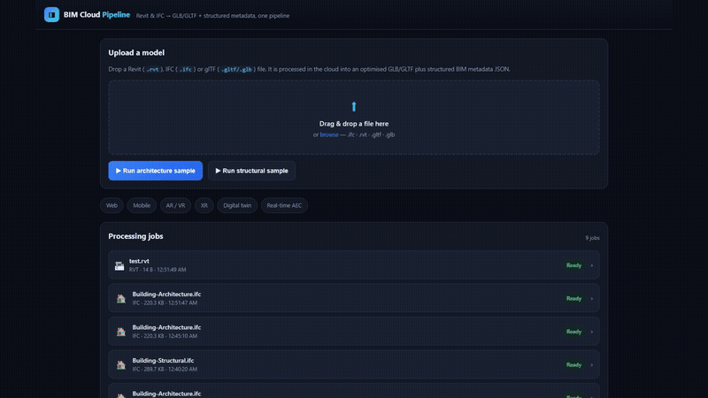
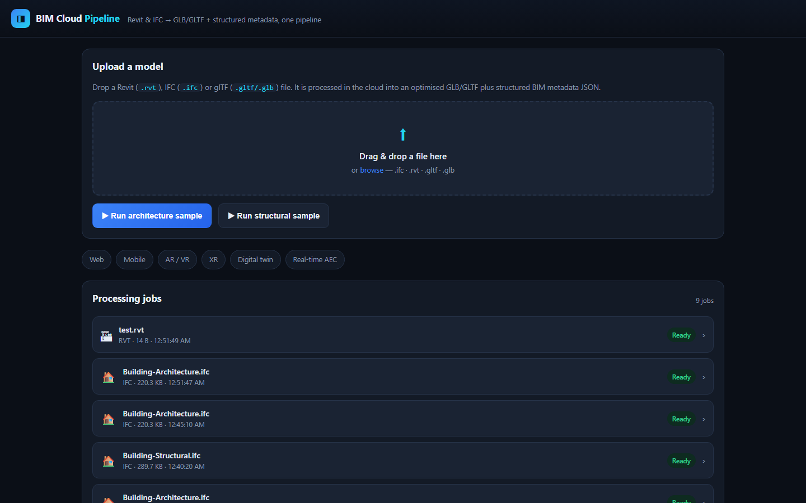
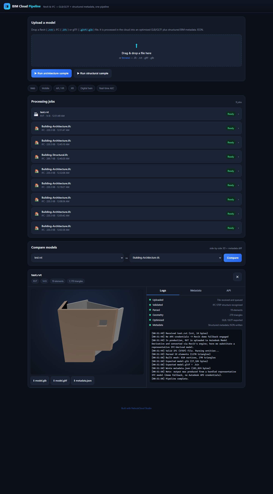
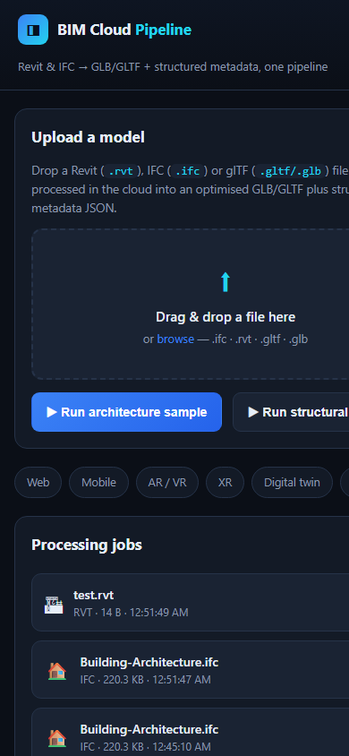
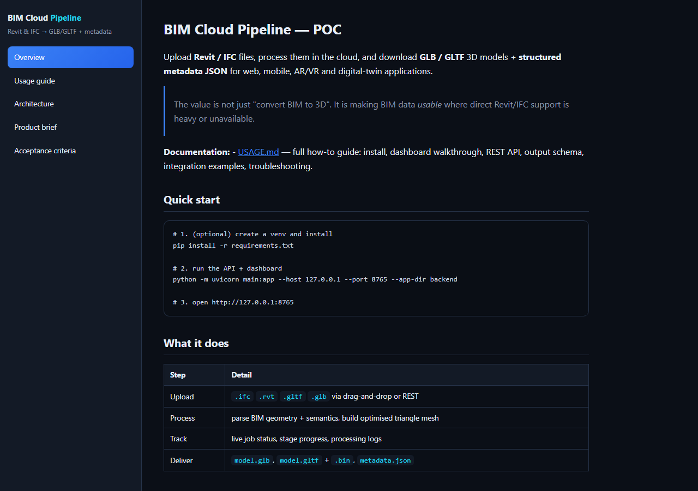
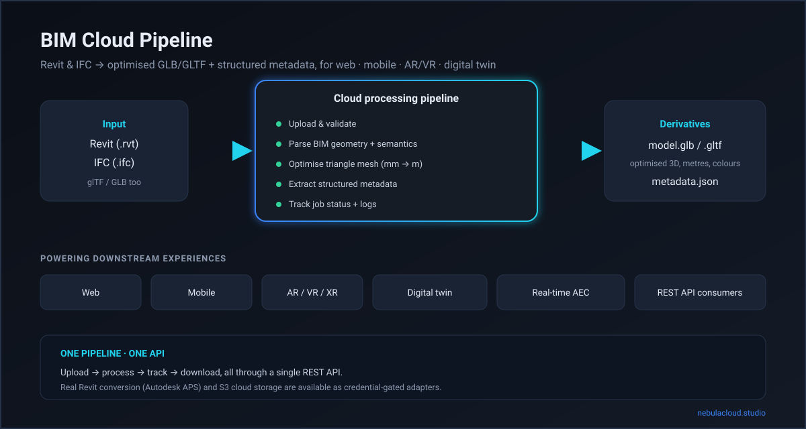

# BIM Cloud Pipeline

**Turn Revit & IFC models into web-ready GLB/GLTF 3D assets and structured metadata JSON — through one cloud pipeline and one API.**

> This repository is the public project showcase for **BIM Cloud Pipeline**,
> created using **NebulaCloud Studio**.
>
> The full engineering implementation is published separately at
> **[studio-public-demos/bim-cloud-pipeline](https://github.com/studio-public-demos/bim-cloud-pipeline)**.

---

## Overview

BIM Cloud Pipeline is a cloud service that takes heavyweight BIM files — Autodesk
Revit (`.rvt`) and IFC (`.ifc`) — and converts them into the lightweight, open
formats that web, mobile, AR/VR, XR, and digital-twin applications actually need:

- **`model.glb` / `model.gltf`** — optimised, self-contained 3D assets (metres, with
  material colours preserved).
- **`metadata.json`** — structured BIM data (elements, property sets, quantities,
  materials, classification, spatial containment).

Every job is tracked with live status, stage progress, and processing logs, and the
whole thing is exposed as a clean REST API for integration into custom products.

## Business Problem

BIM models live inside heavy, desktop-bound formats. Direct Revit/IFC support on the
web, on mobile devices, and inside AR/VR headsets is difficult, slow, or unavailable.
Teams spend significant engineering effort just to extract a viewable model and its
data before they can build any downstream product.

## Solution Overview

A single pipeline removes that friction:

1. **Upload** Revit / IFC (or glTF/GLB) files through a dashboard or API.
2. **Process** on the cloud — geometry is parsed and optimised, semantics are extracted.
3. **Track** job status, stage-by-stage progress, and processing logs.
4. **Download** optimised GLB/GLTF plus structured metadata JSON.
5. **Integrate** through a REST API, or **compare** two models side-by-side.

## Live Demo

**Try it now:** [studio-public-demos.github.io/bim-cloud-pipeline-showcase](https://studio-public-demos.github.io/bim-cloud-pipeline-showcase/)

The interactive application — upload, job tracking, live 3D viewer, metadata
explorer, and model comparison — is demonstrated in the screenshots and
walkthrough below. The full pipeline (upload → process → track → download) runs
in the [implementation repository](https://github.com/studio-public-demos/bim-cloud-pipeline).

## Demo Video

A short walkthrough of the dashboard, mobile view, and 3D viewer:



**▶ Live demo:** [studio-public-demos.github.io/bim-cloud-pipeline-showcase](https://studio-public-demos.github.io/bim-cloud-pipeline-showcase/)

## Project Screenshots

| | |
|---|---|
|  |  |
| **Dashboard** — upload, job list, and live 3D viewer | **Full app** — processing stages, logs, downloads |
|  |  |
| **Mobile-responsive** (390 px) | **Browsable documentation** hub |

## Generated Outputs

Representative outputs produced from the bundled buildingSMART sample IFC are included:

| Output | Description |
|--------|-------------|
| [`assets/outputs/sample-model.glb`](assets/outputs/sample-model.glb) | Optimised binary glTF (17 KB, 270 triangles) |
| [`assets/outputs/sample-metadata.json`](assets/outputs/sample-metadata.json) | Structured BIM metadata (19 elements) |

The GLB opens in any glTF viewer (Three.js, `<model-viewer>`, Blender, Unity/Unreal,
AR Quick Look). The metadata JSON exposes GlobalIds, categories, materials, property
sets (`Pset_*`), quantities (`Qto_*`), and spatial containment.

## Key Features

- **Upload Revit & IFC** (and glTF/GLB) via drag-and-drop or REST.
- **Cloud processing jobs** with live status, stage progress, and timestamped logs.
- **Optimised GLB/GLTF** — millimetre-to-metre conversion, per-element material colours.
- **Structured metadata JSON** — property sets, quantities, materials, classification.
- **Interactive 3D viewer** and a **metadata explorer** in the dashboard.
- **Multi-model compare view** — side-by-side 3D plus an element/category diff.
- **REST API** for building custom web/mobile/AR/VR/twin products.
- **Credential-gated adapters** — real Revit conversion via Autodesk APS, and S3 cloud
  storage with presigned URLs.
- **Responsive** from 320 px to desktop, no horizontal overflow.

## Intended Users

- **BIM / VDC teams** publishing models for review and downstream use.
- **Construction-technology developers** building web/mobile BIM apps on APIs.
- **AR / VR / XR teams** needing lightweight, runtime-friendly glTF assets.
- **Digital-twin teams** feeding geometry + metadata into twin platforms.

## Example Use Cases

- A web-based model review portal for project stakeholders.
- A mobile field app rendering buildings on constrained devices.
- An AR walkthrough of a building imported from Revit.
- A digital twin that pairs a 3D model with live sensor data keyed by element GlobalId.
- An API that normalises mixed-format BIM input into one consistent output.

## Technical Highlights (High-Level)

- **No BIM desktop dependency** — conversion runs entirely in the cloud.
- **Dual output from a single parse** — geometry and semantics stay consistent.
- **Format-routed processing** — IFC is parsed natively; glTF/GLB is normalised; Revit
  routes through the Autodesk APS (Model Derivative) adapter.
- **Faithful units** — IFC millimetres are converted to glTF-standard metres, so assets
  drop straight into AR/VR and web viewers.
- **Async jobs with live progress** — stages and logs are streamed to the dashboard.

## Architecture Overview (Conceptual)



```
 Revit (.rvt) / IFC (.ifc)
        │
        ▼
 Cloud processing pipeline
   upload → validate → parse → optimise → metadata
        │
        ▼
 model.glb / model.gltf  +  metadata.json
        │
        ▼
 Web · Mobile · AR/VR · XR · Digital twin · Real-time AEC
```

## Technical Scope & Limitations

- **Fidelity:** illustrative/functional. Geometry covers tessellated meshes and
  extruded profiles (rectangle / arbitrary-closed / circle); advanced BREP/CSG is out
  of scope.
- **Suitable for:** viewing, downstream web/AR/VR/twin prototyping, API integration.
- **Not suitable for:** engineering analysis or legal documentation.
- **Revit & S3 adapters** require the user's own credentials (Autodesk APS / AWS) and
  fall back gracefully when absent.
- Auth, multi-tenancy, and billing are production concerns, intentionally not shown.

## Performance Summary (Verified)

| Metric | Value |
|--------|-------|
| Architecture sample (225 KB IFC) → optimised GLB | 19 elements → **270-triangle** GLB (**17 KB**, ~92% smaller) |
| Structural sample (296 KB IFC) | 18 elements → 1,548 triangles |
| Model comparison | 4 common / 14 added / 15 removed elements between disciplines |
| Responsive viewports | 320 / 375 / 768 / 1280 px — no horizontal overflow |
| 3D rendering | Verified in WebGL (Two simultaneous viewers load both models) |

## Attribution

Third-party assets and technologies used in this showcase are credited in
[`ATTRIBUTIONS.md`](ATTRIBUTIONS.md). Sample BIM data is from the buildingSMART
`Sample-Test-Files` repository.

## Built with NebulaCloud Studio

This project was designed, built, launched, and verified with
[NebulaCloud Studio](https://nebulacloud.studio).

## Related Project Showcases

Explore more work from NebulaCloud Studio on the
[Studio showcase hub](https://nebulacloud.studio).

## Call to Action

Want a BIM-to-web pipeline for your team, or a similar custom AEC application?
[Contact NebulaCloud Studio](https://nebulacloud.studio) to discuss your use case.
