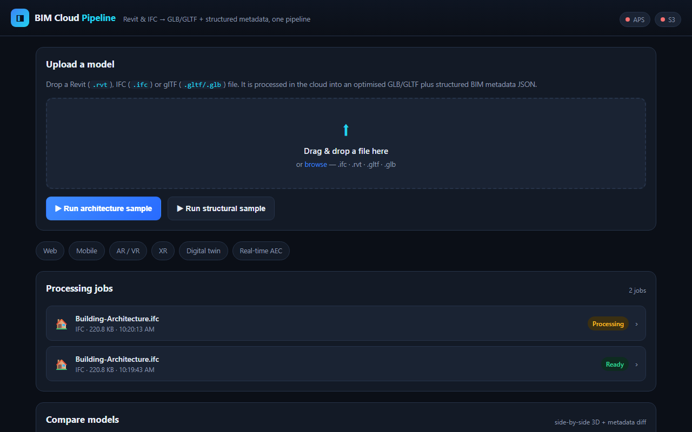
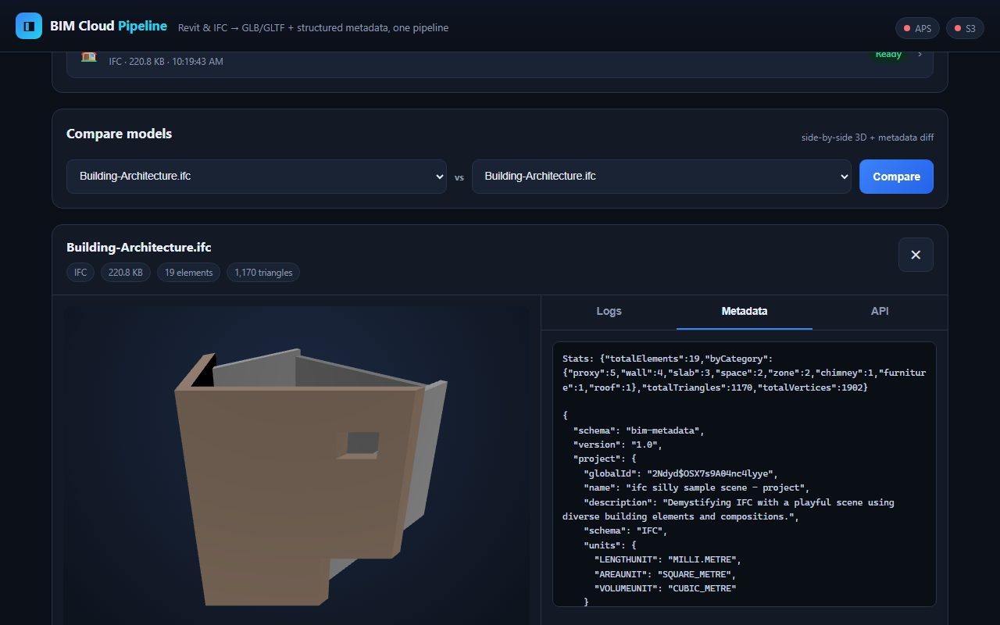
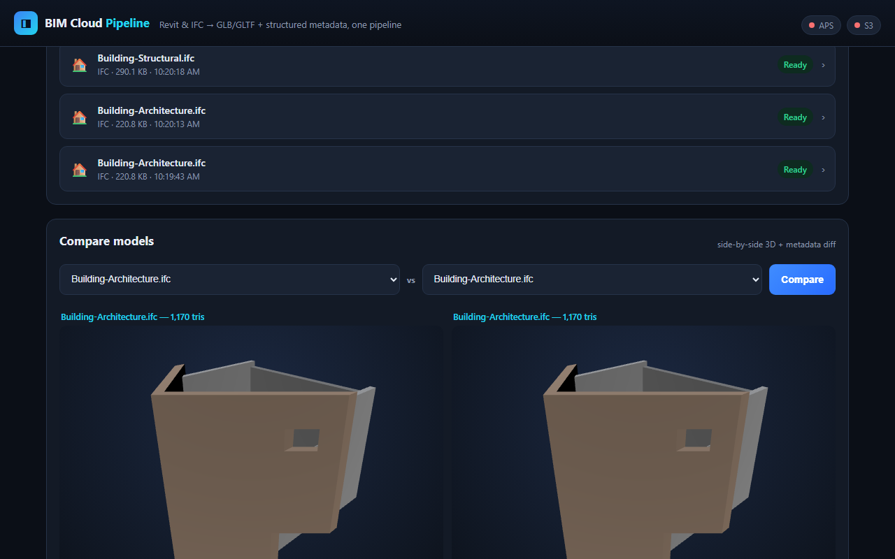
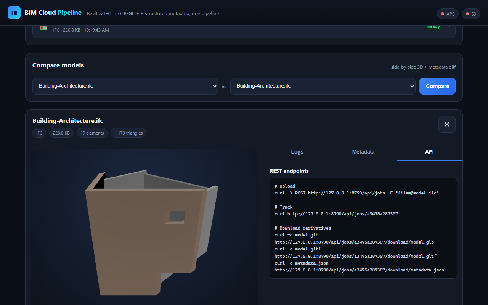
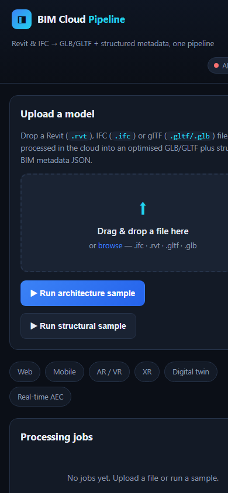

# BIM Cloud Pipeline

**Turn IFC / Revit-derived BIM into optimized GLB/GLTF 3D assets and structured metadata for web, mobile, XR and digital-twin applications.**

> This repository is the public project showcase for **BIM Cloud Pipeline**,
> created using **NebulaCloud Studio**.
>
> The full engineering implementation is published separately at
> **[studio-public-demos/bim-cloud-pipeline](https://github.com/studio-public-demos/bim-cloud-pipeline)** (MIT).

---

## What this is

A **proof-of-concept / reference implementation** demonstrating BIM
interoperability: BIM input → cloud-style processing → optimized 3D geometry +
structured BIM metadata → visualization → model comparison → API-accessible
outputs → downstream web/mobile/XR/digital-twin applicability.

## What this is not

It is **not** a replacement for Revit, a BIM authoring or engineering-analysis
application, a contractual BIM validation system, or a production multi-tenant
SaaS platform.

## Overview

BIM Cloud Pipeline takes heavyweight BIM input — IFC (`.ifc`, primary) and
Revit-derived IFC (via optional Autodesk APS) — and produces the lightweight,
open formats that web, mobile, AR/VR, XR, and digital-twin applications need:

- **`model.glb` / `model.gltf`** — optimised, self-contained 3D assets (metres, with
  material colours preserved).
- **`metadata.json`** — structured BIM data (elements, property sets, quantities,
  materials, classification, spatial containment).

> **The GLB tells an application what the building looks like. The metadata tells it what the building means.**

Every job is tracked with live status, stage progress, and processing logs, and the
whole thing is exposed as a clean REST API for integration into custom products.

## Business Problem

BIM models live inside heavy, desktop-bound formats. Direct Revit/IFC support on the
web, on mobile devices, and inside AR/VR headsets is difficult, slow, or unavailable.
Teams spend significant engineering effort just to extract a viewable model and its
data before they can build any downstream product.

## Solution Overview

A single pipeline removes that friction:

1. **Upload** IFC (or glTF/GLB) files through a dashboard or API.
2. **Process** on the cloud — geometry is parsed and optimised, semantics are extracted.
3. **Track** job status, stage-by-stage progress, and processing logs.
4. **Download** optimised GLB/GLTF plus structured metadata JSON.
5. **Integrate** through a REST API, or **compare** two models side-by-side.

## Live Demo

**▶ Try the live POC:** [bim-cloud-pipeline.onrender.com](https://bim-cloud-pipeline.onrender.com/) —
upload your own IFC (.ifc) / glTF (.glb) file, or run the bundled Architecture and
Structural samples, and watch them convert to GLB/GLTF + structured metadata in real
time. *Availability may vary on demonstration infrastructure.*

**Instant static preview (no backend):** [studio-public-demos.github.io/bim-cloud-pipeline-showcase](https://studio-public-demos.github.io/bim-cloud-pipeline-showcase/)

The full pipeline (upload → process → track → download) runs in the
[implementation repository](https://github.com/studio-public-demos/bim-cloud-pipeline).

> **Public demo:** the live deployment runs in `PUBLIC_DEMO_MODE` — uploads stay
> **enabled** (bounded by file-size/concurrency/rate limits), job history is scoped
> per visitor, jobs/outputs are auto-expired, and the dashboard warns never to
> upload confidential models. See *Public safety* below.

## Demo Video

Full walkthrough (~3 min) of the dashboard, 3D viewer, metadata and comparison:

- **Full demo:** [`assets/videos/demo-full.mp4`](assets/videos/demo-full.mp4)
- **Short (social):** [`assets/videos/demo-short.mp4`](assets/videos/demo-short.mp4)


**▶ Interactive showcase:** [studio-public-demos.github.io/bim-cloud-pipeline-showcase](https://studio-public-demos.github.io/bim-cloud-pipeline-showcase/)

## Project Screenshots

| | |
|---|---|
|  |  |
| **Dashboard** — upload, job list, samples | **Architecture model** — 3D viewer (GLB) |
|  |  |
| **Metadata** — structured BIM JSON | **Comparison** — Architecture vs Structural |
|  |  |
| **API** — REST endpoints | **Mobile-responsive** (390 px) |

## Generated Outputs

Representative outputs produced from the bundled buildingSMART sample IFC are included:

| Output | Description |
|--------|-------------|
| [`assets/outputs/sample-model.glb`](assets/outputs/sample-model.glb) | Architecture sample — optimised binary glTF (17 KB, 270 triangles) |
| [`assets/outputs/sample-metadata.json`](assets/outputs/sample-metadata.json) | Architecture sample — structured BIM metadata (19 elements) |
| [`assets/outputs/structural-model.glb`](assets/outputs/structural-model.glb) | Structural sample — optimised binary glTF (43 KB, 712 triangles) |
| [`assets/outputs/structural-metadata.json`](assets/outputs/structural-metadata.json) | Structural sample — structured BIM metadata (18 elements) |

### GLB vs metadata.json

- **`model.glb`** is the *visual* mesh. Analytical volumes (spaces, zones) and
  geo-reference proxies are excluded so the model renders cleanly. Units are metres
  (glTF standard), with per-element material colours.
- **`metadata.json`** is the *semantic* record. Elements carry GlobalId, category,
  material, property sets (`Pset_*`), quantities (`Qto_*`) and spatial containment.

The GLB opens in any glTF viewer (Three.js, `<model-viewer>`, Blender, Unity/Unreal,
AR Quick Look). The metadata JSON is what you query to reason about the building.

## Key Features

- **Upload Revit & IFC** (and glTF/GLB) via drag-and-drop or REST.
- **Cloud processing jobs** with live status, stage progress, and timestamped logs.
- **Optimised GLB/GLTF** — millimetre-to-metre conversion, per-element material colours.
- **Structured metadata JSON** — property sets, quantities, materials, classification.
- **Interactive 3D viewer** and a **metadata explorer** in the dashboard.
- **Multi-model compare view** — side-by-side 3D plus an element/category diff.
- **REST API** for building custom web/mobile/AR/VR/twin products.
- **Credential-gated adapters** — real Revit conversion via Autodesk APS, and S3 cloud
  storage with presigned URLs.
- **Responsive** from 320 px to desktop, no horizontal overflow.

## Intended Users

- **BIM / VDC teams** publishing models for review and downstream use.
- **Construction-technology developers** building web/mobile BIM apps on APIs.
- **AR / VR / XR teams** needing lightweight, runtime-friendly glTF assets.
- **Digital-twin teams** feeding geometry + metadata into twin platforms.

## Example Use Cases

- A web-based model review portal for project stakeholders.
- A mobile field app rendering buildings on constrained devices.
- An AR walkthrough of a building imported from Revit.
- A digital twin that pairs a 3D model with live sensor data keyed by element GlobalId.
- An API that normalises mixed-format BIM input into one consistent output.

## How it works

1. **Upload** — Revit (.rvt), IFC (.ifc) or glTF/GLB via dashboard or REST.
2. **Process** — geometry is parsed and optimised; semantics are extracted.
3. **Track** — live job status, stage-by-stage progress, and logs.
4. **Download** — optimised GLB/GLTF plus structured metadata JSON.
5. **Integrate** — REST API, or compare two models side-by-side.

## Technical Highlights (High-Level)

- **No BIM desktop dependency** — conversion runs entirely in the cloud.
- **Dual output from a single parse** — geometry and semantics stay consistent.
- **Format-routed processing** — IFC is parsed natively; glTF/GLB is normalised; Revit
  routes through the Autodesk APS (Model Derivative) adapter.
- **Faithful units** — IFC millimetres are converted to glTF-standard metres, so assets
  drop straight into AR/VR and web viewers.
- **Async jobs with live progress** — stages and logs are streamed to the dashboard.

## Architecture Overview (Conceptual)


```
 Revit (.rvt) / IFC (.ifc)
        │
        ▼
 Cloud processing pipeline
   upload → validate → parse → optimise → metadata
        │
        ▼
 model.glb / model.gltf  +  metadata.json
        │
        ▼
 Web · Mobile · AR/VR · XR · Digital twin · Real-time AEC
```

### Canonical Revit (.rvt) route

```
.rvt ──► Autodesk APS Model Derivative ──► IFC derivative ──► native IFC pipeline ──► GLB/GLTF + metadata.json
```

Native `.rvt` parsing requires Autodesk APS (Model Derivative). With `APS_CLIENT_ID` /
`APS_CLIENT_SECRET` set, the pipeline translates the `.rvt` to an **IFC derivative**
(Revit's own IFC export), downloads it, and feeds it through the native IFC parser.
Without credentials the job fails with a clear error — an uploaded file is never
replaced by a bundled sample.

## Capability status

To be precise about what "works": this distinguishes what is **live-validated** vs
**implemented + unit-tested (mocked)** vs **implemented**.

| Capability | Status |
|-----------|--------|
| IFC → GLB/GLTF + metadata (native parser) | **Live-validated** — real buildingSMART IFC4 samples processed end-to-end |
| glTF/GLB normalisation | **Live-validated** |
| Multi-model compare (metadata diff) | **Live-validated** — 4 common / 14 added / 15 removed |
| Job tracking, downloads, REST API | **Live-validated** |
| Responsive dashboard + Three.js viewer | **Live-validated** — 320/375/768/1280 px, WebGL renders both samples |
| Revit `.rvt` → Autodesk APS Model Derivative | **Implemented + unit-tested (mocked)** — *not live-validated* (requires a live APS account) |
| S3 cloud storage (presigned URLs) | **Implemented + unit-tested (mocked)** — *not live-validated* (requires live AWS credentials) |

## Public safety

The live deployment is hardened for public visitors while keeping a real POC
experience:

- **Uploads enabled with limits** — visitors can upload `.ifc`/`.rvt`/`.gltf`/`.glb`
  (bounded by file-size, concurrency, and rate limits). Samples-only mode is
  available via `DISABLE_UPLOADS=1`.
- **Per-visitor job history** — visitors cannot see each other's jobs, downloads, or
  comparisons.
- **TTL cleanup** — finished jobs and outputs are automatically deleted.
- **Visible warning** — the dashboard warns visitors never to upload confidential or
  proprietary models.

## Performance Summary (Verified)

| Metric | Value |
|--------|-------|
| Architecture sample (226 KB IFC) | 19 elements → **270-triangle** GLB (**17 KB**, ~92% smaller) |
| Structural sample (297 KB IFC) | 18 elements → **712-triangle** GLB (**43 KB**, ~85% smaller) |
| Metadata triangle counts | 1,170 (arch) / 1,548 (struct) — includes analytical spaces/zones excluded from the GLB |
| Model comparison | 4 common / 14 added / 15 removed elements between disciplines |
| Responsive viewports | 320 / 375 / 768 / 1280 px — no horizontal overflow |
| 3D rendering | Verified in WebGL (simultaneous viewers load both models) |

## Attribution

Third-party assets and technologies used in this showcase are credited in
[`ATTRIBUTIONS.md`](ATTRIBUTIONS.md). Sample BIM data is from the buildingSMART
`Sample-Test-Files` repository.

## Built with NebulaCloud Studio

This project was designed, built, launched, and verified with
[NebulaCloud Studio](https://nebulacloud.studio) — including the dependency-free IFC
parser, derivative builder, REST API, dashboard, docs, tests, and this showcase.

## Pre-launch acceptance checklist

Before publishing the social campaign, the following must be verified end-to-end:

- [x] Architecture sample runs end-to-end (upload → process → GLB + metadata).
- [x] Structural sample runs end-to-end.
- [x] Comparison (Architecture vs Structural) produces the element/category diff.
- [x] All downloads (model.glb / model.gltf / metadata.json) return 200.
- [x] Metadata matches the source IFC (GlobalIds, `Pset_*` / `Qto_*`, containment).
- [x] Mobile viewports verified (375 / 390 px, no horizontal overflow).
- [x] Desktop viewports verified (1280 / 1440 px).
- [x] No blocking console errors.
- [x] Clean 30–60 s demo sequence recorded (Architecture → inspect → Structural → inspect → Compare → download metadata).

## Related Project Showcases

Explore more work from NebulaCloud Studio on the
[Studio showcase hub](https://nebulacloud.studio).

## Call to Action

Want a BIM-to-web pipeline for your team, or a similar custom AEC application?
[Contact NebulaCloud Studio](https://nebulacloud.studio) to discuss your use case.
